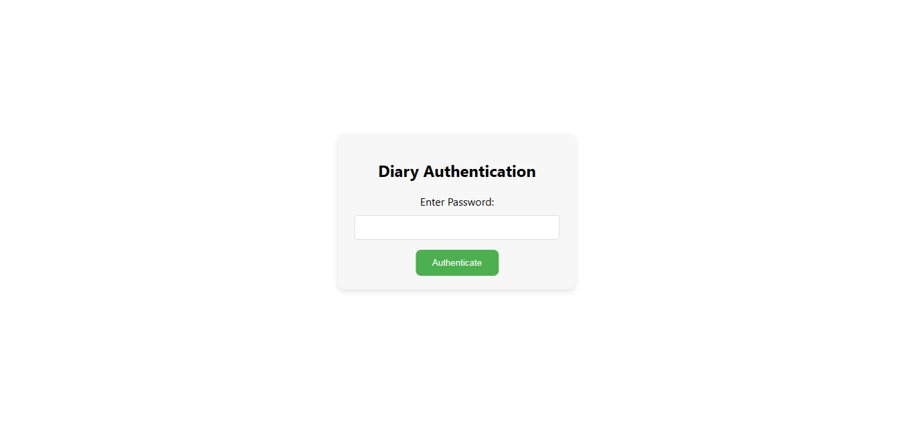
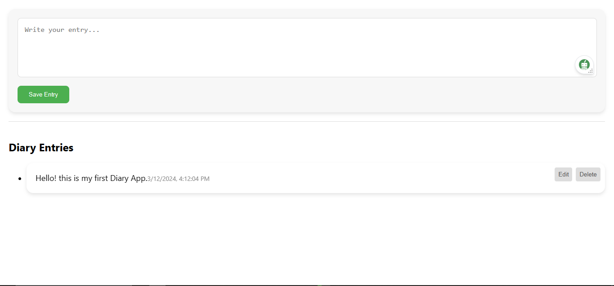

# Diary App

The Diary App is a simple React application that allows users to create, edit, and delete diary entries. It includes basic authentication using a password.




## Table of Contents

- [Features](#features)
- [Getting Started](#getting-started)
  - [Prerequisites](#prerequisites)
  - [Installation](#installation)
- [Usage](#usage)
- [Password](#password)
- [Contributing](#contributing)
- [License](#license)

## Features

- Create, edit, and delete diary entries.
- Basic authentication with a password.

## Getting Started

### Prerequisites

Make sure you have Node.js and npm installed on your machine.

- Node.js: [Download and Install Node.js](https://nodejs.org/)

### Installation

1. Clone the repository:

   ```bash
   git clone https://github.com/gmpsankalpa/diary-app.git

2. Navigate to the project directory:

   ```bash
   cd diary-app

3. Install dependencies:

   ```bash
   npm install

## Usage

1. Start the development server:

   ```bash
   npm start

2. Open your browser and go to http://localhost:3000.

3. Authenticate with the password to access the diary features.

## Password

- The default password for authentication is set to `1234`. You can change this password in the `DiaryApp.js` file.

    ```jsx
    const correctPassword = '1234'; // Change this to your desired password

## Contributing

Contributions are welcome! If you have any improvements or features you'd like to add, please follow these steps:

1. Fork the repository.
2. Create a new branch for your feature: `git checkout -b feature-name`
3. Commit your changes: `git commit -m 'Add some feature'`
4. Push to the branch: `git push origin feature-name`
5. Submit a pull request.

## License

This project is licensed under the [MIT](LICENSE) License.

---

<div align="center">

   
   
   
   

</div>